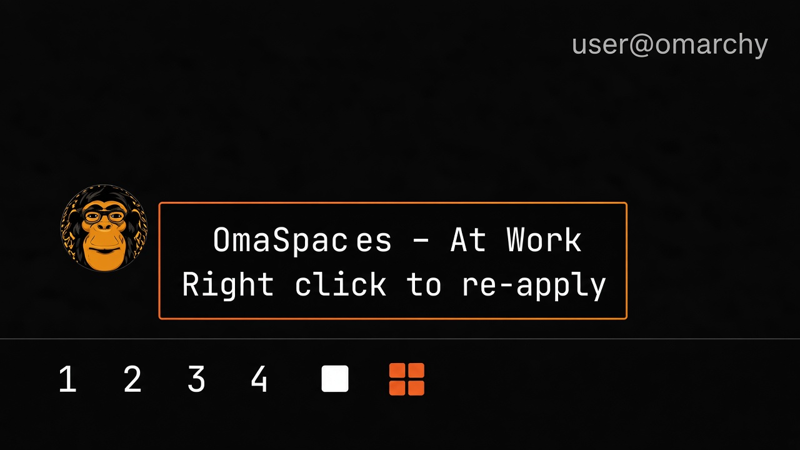

# OmaSpaces



Workspace profiles for the Omarchy bar. One click on the grid icon, pick
**At Work**, and Chrome opens on workspace 1, X on 2, WhatsApp on 3 — every
time, in the same places.

## Install

Omarchy 4.x (Quattro). From a terminal:

```bash
omarchy plugin add https://github.com/L0nE-F0x/omarchy-omaspaces.git --enable
omarchy bar put lonefox.omaspaces --section left
```

OmaSpaces does not rewrite your Hyprland or shell config for you. Spaces are
stored in `~/.config/omarchy/omaspaces.json`, created the first time you save
or capture one.

### Optional: apply a space at login

If a space has **Apply this space at login** turned on, install the bundled
post-boot hook yourself (one-time):

```bash
mkdir -p ~/.config/omarchy/hooks/post-boot.d
cp ~/.config/omarchy/plugins/lonefox.omaspaces/hooks/omaspaces-login.hook \
  ~/.config/omarchy/hooks/post-boot.d/
chmod +x ~/.config/omarchy/hooks/post-boot.d/omaspaces-login.hook
```

Without that copy, the login flag in the panel is ignored. The hook only runs
the engine's `login` command; it does not write other config.

## Remove

```bash
omarchy plugin remove lonefox.omaspaces --yes
```

Then, if you installed the login hook:

```bash
rm -f ~/.config/omarchy/hooks/post-boot.d/omaspaces-login.hook
```

Your saved spaces in `~/.config/omarchy/omaspaces.json` are left alone so you
can keep them if you reinstall.

## Dependencies

All local. OmaSpaces does not phone home.

| Need | Used for |
|---|---|
| `/usr/bin/python3` | `omaspaces` engine |
| `hyprctl` | list clients, move windows, dispatch launches |
| Omarchy shell / Quickshell | bar widget and panel UI |

No network, no downloads, no sudo. The engine talks only to the local
Hyprland socket through `hyprctl`.

## Using it

- **Left click** the bar icon for the list of spaces. Click one to apply it.
- **Right click** the bar icon to re-apply the last space without opening
  the panel.
- **Capture the current layout** turns whatever is on screen right now into a
  new space, apps and workspace numbers already filled in.
- The **gear** on a row opens its editor: rename it, add or drop apps, change
  which workspace each one lands on.
- Keyboard, with the panel open: `1`–`9` apply that space, `↑`/`↓` and `Enter`
  do the same, `e` edits the highlighted space, `n` makes a new one, `c`
  captures the current layout, `Esc` closes.

Applying a space never closes anything by default. An app that is already
running is moved to its workspace rather than started a second time.

## Per-space options

| Option | What it does |
|---|---|
| Finish on workspace | Where you end up once everything is open. |
| Follow along while it opens | Focus each target workspace as its app starts. Leave it on — it is what makes browser windows land right the first time. |
| Close everything else first | Closes every window that is not part of the space before opening it. Off by default. |
| Apply this space at login | Runs this space once per boot, via the optional `post-boot.d` hook above. Only one space can hold it. |

## CLI

The engine runs without the panel:

```bash
~/.config/omarchy/plugins/lonefox.omaspaces/omaspaces list
~/.config/omarchy/plugins/lonefox.omaspaces/omaspaces apply at-work
~/.config/omarchy/plugins/lonefox.omaspaces/omaspaces capture "Recording Content"
```

## How placement works

Hyprland can pin a launched window to a workspace with a process token, and
for a normal app that is enough. It is not enough for a Chrome web app:
`chrome --app=URL` hands the request to the browser that is already running,
and *that* process opens the window with no token.

So every launch is verified rather than trusted. The engine focuses the
target workspace, launches, waits for the new window to map, and — if it
still landed somewhere else — moves it. It also records the window class the
app turned out to have, which is how the next apply knows the app is already
open.

## Files

```
manifest.json              plugin metadata and bar-widget settings schema
BarWidget.qml              the bar icon
Panel.qml                  list of spaces and the per-space editor
omaspaces                  engine: apply, capture, login (Python 3)
hooks/omaspaces-login.hook optional post-boot hook (copy into place yourself)
preview.png                marketplace card image
```

Config: `~/.config/omarchy/omaspaces.json`

After changing the QML, rescan or restart the shell:

```bash
omarchy-shell shell rescanPlugins
```

## License

MIT. See `LICENSE`.
